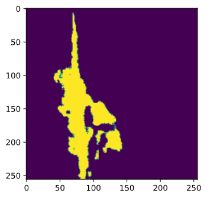

# Wound Segmentation Project Using Partial Differential Equations Deep Learning
## 1. Big Idea: 
  We want to analyze the wound healing process by using mathematical models. We treat the way protein, keratin, covers at a wound as a diffusion process. There are many ways to solve this numerical problem. However, we believe that ADI method is the good way to do that.
  Our problem will be divided into two main tasks: 
  - 1. Working with the wound images. 
  - 2. Working with the mathematical model.
## Working with tasks
### 1. Working with the wound images. 
  Recognizing the wounds in the image and mapping images with different time to the same scale because each image is captured in different angle and different distances from the wound. Thus, we want to align all of them in the same scales. (zoom, rotate)
  - Dataset: We receive the dataset which contains multiple images of the wounds of patients. (One patient have different images in different times). 
  #### Subtask 1. Recognizing the wounds in the images. 
  For this task, we want to use Deep Learning, there have been many works that involving this type of segmentation. Most common approach is using "Encoder-Decoder" models. We have tried to use different Deep Learning models to implement this task. So these are the results of two models which are U-Net and Residual U-Net model. 
  Problems encountered: Lack of data. -> Residual U-Net performs worse than U-Net Model.
  Loss function : pixel-wise cross entropy loss, dice coefficient. 
 #### Subtask 2. Aligning the wounds in the images. 
  Finding the correct zoom factor and rotation factor between two images. 
  1. Finding center of mass of the wound 
  2. Getting the small windows of images
  3. Getting the frame of images
  4. Try different combinations of rotation and angle to identify maximum number of matches pixels between two images. 
### 2. Working with the mathematical model.

## Datasets
- The dataset is supported by [Department of Mathematics (Texas Christian University)](https://cse.tcu.edu/mathematics/index.php) - Confidential 
- To simplize this project, we divide it into three main steps below and we will analyze details into those.

## 1. Traning
Purpose: 
- Initializing the models 
- Get the weights of the deep learning model 
Note: 
- Because there are three models need to be trained then we need to run train 3 times including path to three types of dataset (need to be fixed) 
### Input
Necessary Information:
- Images of the wound (In this program, the default place is "dataset/train/" + training images path)
- Ground truth images of the wound (In this program, the default place is "dataset/train/" + ground truth images path)
Parameters: 
- Path to the dataset (train_src), (path_src)
- Path to model save directory (saved_model)
- Note: Need to update (more arguments for batch_size, epoches, learning_rate,...)
```
python3 train.py --train_src dataset/train/train_wound \
--mask_src dataset/train/mask_wound \
--saved_model model_save
```
### Output
- The weights of the deep learning model. 
  - In this problem, we want three weights (wound, skin (not including the wound), both (skin including the wound))
  - We want to compare the performance between skin_model not including the wound and both_model including the wound.
- The weights are saved default into model_save + name of the model

## 2. Predicting
Purpose: 
- Get all the models to predict the directory of images 
- Combine images with wound and skin 
### Input
Necessary Information: 
- The path to three models that were trained by ```train.py``` 
Parameters: 
- ```'predict_src':```: The directory contain images to predict
- ```'predict_save'```: The directory contain images after predicting
- ```'wound_model'```: Path to wound model
- ```'skin_model'```: Path to skin model
- ```'both_model'```: Path to both model
```
python3 predict.py --predict_src dataset/test/test_img \
--predict_save dataset/prediction \
--wound_model model_save/wound_model/ \
--skin_model model_save/skin_model/ \
--both_model model_save/both_com_model/
```
### Output
- The numpy array of combining images (after predicting) 
<p float="left">
  
   
</p>

## 3. Mappler
Purpose: 
- Because all of the images are taken with different angles and scales, then we want to map all of those into the same scale and angle
### Input
-```'align_path'```: The directory contain images to transform,
```
python3 align.py --align_path dataset/label/
```
### Output
- The list of rotation and scale to match the original image in the align_path directory
## 4. Mathematical Model
- To solve the mathematical model, we implement ADI_solver, which is an approximation method. 
- To find the appropriate parameters for each patients, we implement param_search.py and performs at the main function. The results are saved in the log folder
